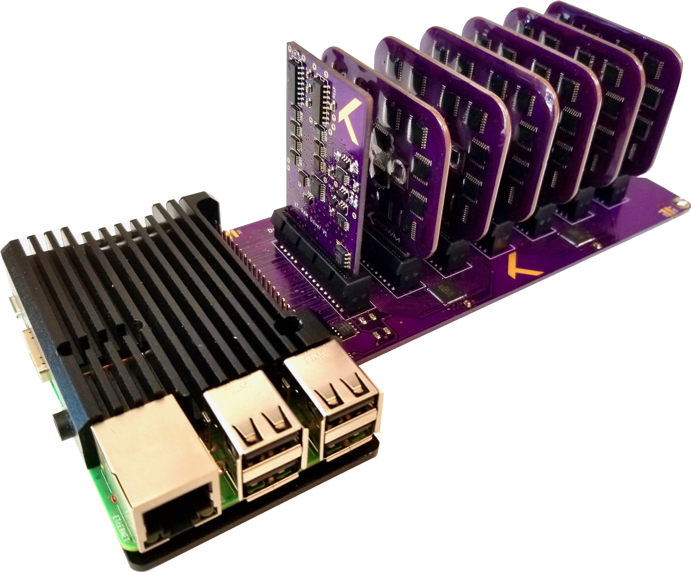
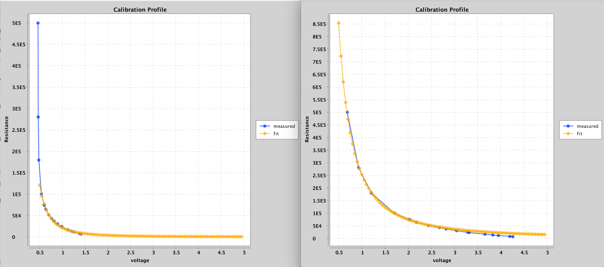
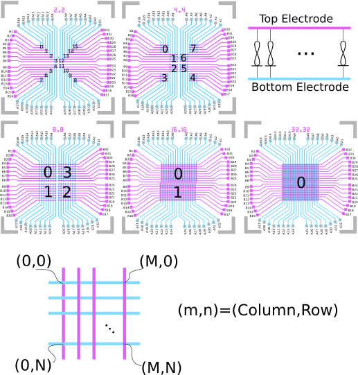

# kT-RAM Raspberry Pi Server

## Introduction

The kT-RAM Raspberry Pi Server ("kTPiSever" or "kTPI" for brevity) is a server for memristor algorithm research and development. It was designed to be extensible and to support a rapid iterative design-test cycles. Through a "unit crossbar" approach, the kT-RAM Server is able to provide access to thousands of memristors, sufficient for the exploration and demonstration of small scale machine learning algorithms. The kTPiServer is not intended for application development, but rather as (1) a step toward fully integrated memristor-CMOS synaptic processors and (2) as a learning resource for professors and students in a post-COVID-19 society, where access to labs may be difficult. As a server, programs can be written and executed from any location with Internet access. In addition, the server can be administered remotely, allowing both student and teachers to design and test memristor algorithms from the comfort and safety of their own homes. Multipl kTPiServers are in use to support the knowm.ai memristor array web-service.  

## System Architecture Overview

The kTPiServer consists of four main components:

1. The `MainBoard` and `Raspberry Pi` computer
1. The `Driver Module`
1. One or more memristor `Array Module`.
1. One `Calibration Module`.

At least one of each component is needed to operate the sever. The calibration array module can only be inserted in the module "6" slot. While the calibration module is needed for initial calibration to create one or more "calibration profiles", it may then be removed and replaced with a memristor array module. Once calibrated, the kTPiServer enables users to select one or more memristors from one or more arrays and drive them with pulses of various amplitudes, widths and polarity. All driver and sensing function is encapsulated in the `Driver Module`, which means that the exact specification for driving and sensing is dependent on module version that is installed. As multiple versions are planned and in development, please refer to the documentation of the specific driver module. 

The architecture follows the "unit crossbar" concept, which is elaborated on in [Alex's blog article here](https://knowm.org/memristor-crossbars-as-easy-as-raspberry-pi/).

A unit crossbar, or more generally a "unit array", is a memristor array that exposes a row/column/enable interface and allows for the selection of one-or-none of the memristors from the array. Unit crossbars can be combined into "meta arrays", which is where computation occurs. The kTPi Server architecture consists of 6 modules, where each module exposes one or more "units", with each unit comprised of one or more unit crossbars. Due to various options for crossbar arrays (2x2, 4x4, 8x8, etc), the actual specification of the platform will depend on what specific array modules are installed. However, the large-scale architecture is relatively simple: each memristor array module exposes two units. In a full-core driver, these two units are treated as a differential pair, allowing two pulse signals to be driven and sensed independently across two differential meta-arrays (differential access). In the half-core drivers, a single pulse is driven and sensed across both units acting together to form one large meta-array (unitary access). 

There are two major planned versions of drivers. The first generation (V1.x) is unitary access while the second generation (V2.x) enables both unitary and differential access. In both versions there are essentially only three main operations:

1. One or more unit crossbars are selected, coupling the desired memristor to the drive terminals.
1. A "write" pulse is generated, potentially causing modification of the selected memristors.
1. A "read" pulse is generated, causuing the sense circuitry to sense the voltage across the programmable series resistor and, via prior calibration, return the resistance, conductance, current, or sense voltage. 

Through selective coupling and driving of memristors in this fashion, it is possible to implement memory, logic and machine learning functions.  

## Java Client

The kTPIServer is a web-application, which means that it can serve any client operating in any programming language. Queries are returned in industry standard JSON format. To facilitate development, a Java Web Client has been written for users and administrators. If you are partial to Python or other programming languages, it should be a simple matter to use the reference Java client and roll your own. 

## Calibration Profiles

After boot-up, the system administrator will need to create one or more calibration profiles before resistance, conductance or current measurements can be obtained. Specific instructions for creation of the calibration profile is available to the system admin. As a user, you must simply understand that generating a profile consist of executing a one-time procedure using a calibration module and specifying the following read pulse properties: 

| Property | Description | Range (V1.x Driver) |
|:--------:|:-----------:|:-------------------:|
|Amplitude | Read pulse voltage amplitude, in volts. | -5v to +5v |
|Width|Read pulse width| 2.5μs to 500μs |
|Series Resistance| resistance of the series resistor, in ohms| 100Ω to 50kΩ|
|Sense gain| gain factor of the sense circuit amplifier| 1 to 50 | 

If a calibration profile has not been generated for the specific read pulse setting used, an error will be generated by the kTPiServer. Once a profile has been generated it is stored for future use and does not have to be generated again. When a calibration curve is generated, the specified read pulse properties are used to access resistor of known values on the calibration chip, mapping the sense voltages to resistances. A calibration curve is then fit to the measured values and used to interpolate future measurements using the calibration profile. This can be seen below for two different calibration profiles.

The calibration profile on the left is better for lower resistances (higher currents):
	
	amplitude = .15, width = 500, seriesResistance = 20000,senseGain = 10
	
The calibration profile on the right is better for higher resistances (lower currents):

	amplitude = .15, width = 500, seriesResistance = 40000,senseGain = 30

The following curve is used to fit the date, where a0-a3 are fit parameters and v is the measurement voltage for the given profile:

	R(v) = a0 * (a1 / v^a3 + a2)

A rapid multivariate optimization is performed that minimizes the sum percent error across the measured calibration curve. While the curve fit is generally good, it may not be perfect in all cases, especially if the calibration profile has been optimized for a particular range. To obtain very accurate measurements, we recommend using multiple profiles optimized for different ranges. A first profile can be used to get a rough measurement, while a subsequent profile can be used which is specialized for measurements within a particular range. To reduce measurement noise, multiple reads can be performed, the results averaged and the variance calculated. Due to the fact that noise can be contextually and time dependent (location, intermittent noise sources, etc), the calibration profile does not include measurement variance. It is up to the user to measure this, if needed.

## Array Addressing

Unit crossbars are accessed by specifying the following:

| Address | Description | Range (V1.x Boards and Modules) |
|:--------:|:-----------:|:-------------------:|
|Module ID | The main board slot where the Array Module is inserted. | 0 through 5 |
|Unit ID | The unit on each Array Module| 0 or 1|
|Array ID | The array on each unit| 0 to 15, depending on Array Module variant|
|Column|The column of the specified array|0 through 32, depending on array variant|
|Row|The row of the specified array|0 through 32, depending on array variant|

Arrays are address in a relative way, where the column and row is relative to the specific array and not the chip bonding pads. This is seen more clearly below:

 
Columns are chosen to be the top electrodes while rows are chosen to be the bottom electrodes. A positive voltage applied across the selected column/row's, where the column is the higher potential, will drive the memristor to a higher conductance. 

The kTPiServer accepts numerous alternate array modules, so the above is for general reference but may not be applicable to your particular setup. Please refer to the specifications of the specific array module for accerate addresing information.

## User Accounts, Array Permissions and Usage Limits

System administrators are responsible for creating user accounts and allocating user access to specific arrays across the kTPIServer. Before you can perform operations on a device within an array, you must be given access by your system administrator. Every access to the web API must include your login and password credentials, which will be provided by your system administrator. Be sure to use HTTPS for all interactions so that your credentials are encrypted.

In addition to array permission, each array is protected with usage limits that prevent unintended exposure to potentially damaging or structurally deforming high currents. It is up to the system administrator to set these values, and if they do not then the system default values will be used. Note that the system administrator may change the default values. 

| Parameter | Description | Default Value |
|:--------:|:-----------:|:-------------------:|
|positive voltage|positive polarity pulse amplitude.| .75V|
|negative voltage|negative polarity pulse amplitude.| -1.0V|
|series resistance|programmable circuit series resistance.| 15kΩ|

Both user array access permission and usage limits are associated with the specific array module, which identifies itself to the kTPIServer. If an array module is moved to another port on the main board, the permissions and usage limits will follow the module to the new port *but you will have to use a new port ID to access it*. For example, lets say that you are granted access to an array on module id (port) 3. At a later time, this module is removed from the board and inserted into port 2 and the system rebooted. You will now have the same permissions to the module, but they will be access by specification of module ID 2 instead of 3. 

# HTTP & Java Client

The kTPiServer handles HTTPS requests and returns JSON data. The intended use is via an HTTP Client in the users preferred programming language. Due to the fact that Alex's primary language is Java, this HTTP Java Client has been provided to simplify the interaction with the server http end-points.  Please refer to the [EndPoints.md](documentation/EndPoints.md) file for a description of the available endpoints.  

